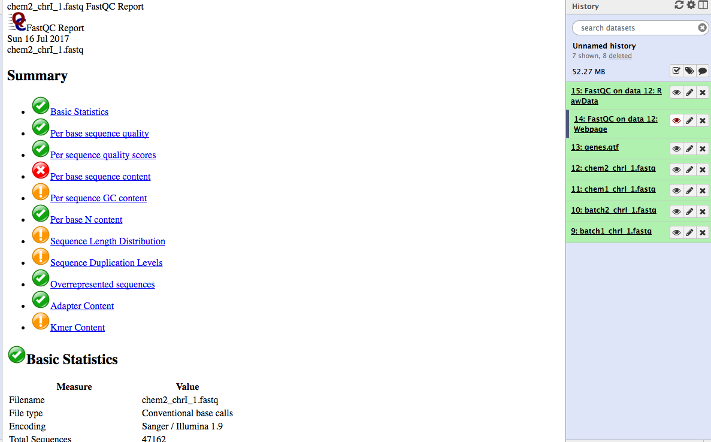

# Hands-on NGS Analysis in Galaxy

### Sheffield Bioinformatics Core


web : [sbc.shef.ac.uk](https://sbc.shef.ac.uk)  
twitter: [@SheffBioinfCore](https://twitter.com/SheffBioinfCore)  
email: [bioinformatics-core@sheffield.ac.uk](bioinformatics-core@sheffield.ac.uk)

-----

## Tutorial Overview

This tutorial will cover the basics of NGS analysis using Galaxy; a open-source web-based platform for the analysis of biological data. You should gain an appreciation of the tasks involved in a typical NGS analysis and be comfortable with the outputs generated by a sequencing service. 

Parts of this tutorial are based on the NGS tutorial from the Galaxy Project

- [Galaxy NGS Tutorial](https://galaxyproject.org/tutorials/ngs/)


-----

## Background

#### Where do the data in this tutorial come from?
The data for this tutorial are publicaly-available exome sequencing data *downsampled* to the BRCA2 region from a fictitious patient. We will use these data throughout the course to call variants, filter and discuss the clinical impact of any mutations. This is paired-end data, so we get two fastq files.

## Section 1: Preparation

#### 1.  Register as a new user on one of the public Galaxy servers

- https://usegalaxy.org/
- https://usegalaxy.org.au
- https://usegalaxy.eu

**Make sure you check your email to activate your account**

#### 2.  Import the data for the workshop.

We can going to import the [*fastq* files](https://en.wikipedia.org/wiki/FASTQ_format) for this experiment. This is a standard format for storing raw sequencing reads and their associated quality scores. However, as we will see, the representation of the quality scores has changed over time.

You can import the data by:

1.  In the tool panel located on the left, under Basic Tools select **Get
    Data > Upload File**. Click on the **Paste/Fetch data** button on the
    bottom section of the pop-up window.
2.  Upload the sequence data by selecting the files `JoeBlogsBRCAPanel_R1.fastq` and `JoeBlogsBRCAPanel_R2.fastq`. Make sure the type is specified as '**fastqsanger**'
    when uploading.


3.  You should now have these 2 files in your history:
    - `JoeBlogsBRCAPanel_R1.fastq`
    - `JoeBlogsBRCAPanel_R2.fastq`


## Section 2: Fastq file format

You can view the files you just uploaded by clicking the **eye icon** the history item. The first few lines should read as follows


**JoeBlogsBRCAPanel_R1.fastq**

```
@HWI-D00461:188:HVGY2BCXY:1:1101:1363:84148/1
TGTGTCATTTCTATTATCTTTGGAACAACCATGAATTAGTCCCTTGGGGTTTTCAAATGCTGCACACTGACTCACACATTTATTTGGTTCTGTTTTTGCCTTCCCTNN
+
DDDDDIHIIIIIHIIIIIIIIIIHIIIIIIIIIHIIIIIIHHIIIIIIIHIIIHIIIIIIIIIIIIIIIIIIIIIIIIIIIIIIIIIIIIIIIIIIIIHHIDHHIHC#
```

**JoeBlogsBRCAPanel_R2.fastq**

```
@HWI-D00461:188:HVGY2BCXY:1:1101:1363:84148/2
TGGAAAGACTTTTGGGGGGGGGAGTATTTTTCTTGTTTCTGGTTTTGGTTTTTTTGATCCGGGAAAGATTTTGTTTTTTGGAGGTTGGACTTTTGGGGAGGGGAAAAN
+
<00<<1111<1<11/0/<///</<0111DF11<<11111<11111<1/1<1D1///<<11<<</<1111<<11<DD1<//<110<11/11<0<0</0<0<<-//<<FE
```


Each read is described by 4 lines in the file:-


The quality scores are [ASCII](http://ascii-code.com/) representations of how confident we are that a particular base has been called correctly. Letters that are further along the alphabet indicate higher confidence. This is important when trying to identify types of genome variation such as single base changes, but is also indicative of the overall quality of the sequencing. Different scales have been employed over time (resulting in a different set of characters appearing in the file). We will need to tell Galaxy which scale has been used in order that we can process the data correctly; hence why we explictly stated the files were of type **fastqsanger** when we uploaded them. 


### Deriving the Quality Score

First of all, we convert the base-calling probability (p) into a `Q` score using the formula

- Quality scores $$ Q = -10log_{10}p$$
    + Q = 30, p=0.001
    + Q = 20, p=0.01
    + Q = 10, p=0.1
- These numeric quanties are *encoded* as [**ASCII**](http://ascii-code.com/) code
    + At least 33 to get to meaningful characters
    (https://en.wikipedia.org/wiki/FASTQ_format)
    
      

### Quality Scores to probabilities

- look-up the ASCII code for each character
- subtract the offset to get the Q score
- convert to a probability using the formula:-

$$ p = 10^{-Q/10} $$

Let's see this calculation for the first few bases of the first read in `JoeBlogsBRCAPanel_R1.fastq`; `DDDDDIHI....`

Character  | Code | Minus 33 Offset | Probability
------------- | ------------- | ------------- | -------------
D  | 68 | 35 | 0.0003162278
D  | 68 | 35 | 0.0003162278
D  | 68 | 35 | 0.0003162278
D  | 68 | 35 | 0.0003162278
D  | 68 | 35 | 0.0003162278
I  | 73 | 40 | 0.0001000000
H  | 72 | 39 | 0.0001258925
I  | 73 | 40 | 0.0001000000

In practice, we don't have to convert the values as we have software that will do this automatically

**Exercise**: 

- How many lines of data are present in the file `JoeBlogsBRCAPanel_R1.fastq`
  + use the tool *Text Manipulation -> Line/Word/Character count* to find out
- How many reads does this correspond to?

-----

## Section 3 (Optional): Quality assessment with FastQC

[FastQC](https://www.bioinformatics.babraham.ac.uk/projects/fastqc/) is a popular tool from [Babraham Institute Bioinformatics Group](https://www.bioinformatics.babraham.ac.uk/index.html) used for *quality assessment* of sequencing data. Most Bioinformatics pipelines will use FastQC, or similar tools in the first stage of the analysis. The [documentation](https://www.bioinformatics.babraham.ac.uk/projects/fastqc/Help/) for FastQC will help you to interpret the plots and stats produced by the tool. A traffic light system is used to alert the user's attention to possible issues. However, it is worth bearing in mind that the tool is blind to the particular type of sequencing you are performing (i.e. whole-genome, ChIP-seq, RNA-seq), so some warnings might be expected due to the nature of your experiment.

- From the left hand tool panel in Galaxy, under *NGS ANALYSIS*, select *NGS: QC and manipulation -> FastQC*
- Select one of the FASTQ files as input and *Execute* the tool.
- When the tool finishes running, you should have an HTML file in your History. Click on the eye icon to view the various quality metrics.

Look at the generated FastQC metrics. This data looks pretty good - high per-base quality scores (most above 30).




## Section 4: Alignment

We don't really spend much time look at *fastq* files, as most of our time is spent with *aligned* reads. i.e. we have used some software to tell us whereabouts in the genome each read belongs to. This will *usually* be performed for you as part of a sequencing service, but it is good to get an appreciation of the steps involved.

In this section we map the reads in our FASTQ files to a reference genome. 


#### 1.Align the example files  


- Find the tool *NGS: Mapping* -> *Bowtie2*
  + alternatively, type `bowtie` in the search box
- In *Is this single-end or Paired-end?* Select **Paired-end**
- Set *FastQ file #1* and *FastQ file #2* to the two fastq files you uploaded in the previous step
- Make sure the reference genome is set to **Human (Homo sapiens)(b37):hg19**
- Press *Execute*
- Wait!

The result will be a `.bam` file that we will describe in the next section. This file is not human-readable, as it is compresed. But we can convert to a readable format for illustration purposes.

#### 2. View the alignments

1.  Click on the eye of the resulting file to view the alignments.


### About the `bam` file format

Unlike most of Bioinfomatics, a *single standard* file format has emerged for aligned reads. Moreoever, this file format is consistent regardless of whether you have DNA-seq, RNA-seq, ChIP-seq... data. 

The `bam` file is a compressed, binary, version of a `sam` file.

### The `.sam` file

- **S**equence **A**lignment/**M**ap (sam) 
- The output from an aligner such as `bwa`
- Same format regardless of sequencing protocol (i.e. RNA-seq, ChIP-seq, DNA-seq etc)
- May contain un-mapped reads
- Potentially large size on disk; ~100s of Gb
    + Can be manipulated with standard unix tools; e.g. *cat*, *head*, *grep*, *more*, *less*....
- Official specification can be [obtained online](http://samtools.github.io/hts-specs/SAMv1.pdf): -
- We normally work on a compressed version called a `.bam` file. See later.
- *Header* lines starting with an `@` character, followed by tab-delimited lines
    + Header gives information about the alignment and references sequences used


The first part of the header lists the names (`SN`) of the sequences (chromosomes) used in alignment, their length (`LN`) and a *md5sum* "[digital fingerprint](https://en.wikipedia.org/wiki/Md5sum)" of the `.fasta` file used for alignment (`M5`).

```
@HD	VN:1.5	SO:coordinate	GO:none
@SQ	SN:1	LN:249250621	M5:1b22b98cdeb4a9304cb5d48026a85128
@SQ	SN:2	LN:243199373	M5:a0d9851da00400dec1098a9255ac712e
@SQ	SN:3	LN:198022430	M5:fdfd811849cc2fadebc929bb925902e5
@SQ	SN:4	LN:191154276	M5:23dccd106897542ad87d2765d28a19a1
.....
.....

```

Next we can define the *read groups* present in the file which we can use to identify which sequencing library, sequencing centre, Lane, sample name etc.

```
@RG	ID:SRR077850	CN:bi	LB:Solexa-42057	PL:illumina	PU:ILLUMINA	SM:NA06984
@RG	ID:SRR081675	CN:bi	LB:Solexa-42316	PL:illumina	PU:ILLUMINA	SM:NA06984
@RG	ID:SRR080818	CN:bi	LB:Solexa-44770	PL:illumina	PU:ILLUMINA	SM:NA06984
@RG	ID:SRR084838	CN:bi	LB:Solexa-42316	PL:illumina	PU:ILLUMINA	SM:NA06984
@RG	ID:SRR081730	CN:bi	LB:Solexa-42316	PL:illumina	PU:ILLUMINA	SM:NA06984
.....
.....

```

Finally, we have a section where we can record the processing steps used to derive the file
```
@PG	ID:MosaikAligner	CL:/share/home/wardag/programs/MOSAIK/bin/MosaikAligner -in /scratch/wardag/NA06984.SRR077850.mapped.illumina.mosaik.CEU.SINGLE.20111114/NA06984.SRR077850.mapped.illumina.mosaik.CEU.SINGLE.20111114.mkb -out
....
....

```

Next is a *tab-delimited* section that describes the alignment of each sequence in detail. 

```
SRR081708.237649	163	1	10003	6	1S67M	=	10041	105	GACCCTGACCCTAACCCTGACCCTGACCCTAACCCTGACCCTGACCCTAACCCTGACCCTAACCCTAA	S=<====<<>=><?=?=?>==@??;?>@@@=??@@????@??@?>?@@<@>@'@=?=??=<=>?>?=Q	ZA:Z:<&;0;0;;308;68M;68><@;0;0;;27;;>MD:Z:5A11A5A11A5A11A13	RG:Z:SRR081708	NM:i:6	OQ:Z:GEGFFFEGGGDGDGGGDGA?DCDD:GGGDGDCFGFDDFFFCCCBEBFDABDD-D:EEEE=D=DDDDC:

```


Column | Official Name | Brief
------ | -------------- | -----------
1      | QNAME          | Sequence ID
2      | FLAG           | Sequence quality expressed as a bitwise flag
3      | RNAME          | Chromosome
4      | POS            | Start Position
5      | MAPQ           | Mapping Quality
6      | CIGAR          | Describes positions of matches, insertions, deletions w.r.t reference
7      | RNEXT          | Ref. name of mate / next read
8      | PNEXT          | Postion of mate / next read
9      | TLEN           | Observed Template length
10     | SEQ            | Sequence
11     | QUAL           | Base Qualities

There can also be all manner of optional tags as extra columns introduce by an aligner or downstream analysis tool. A common use is the `RG` tag which refers back to the read groups in the header.


### Dr Mark Dunning presents....Fun with flags!

The *"flags"* in the sam file can represent useful QC information

  + Read is unmapped
  + Read is paired / unpaired
  + Read failed QC
  + Read is a PCR duplicate (see later)

The combination of any of these properties is used to derive a numeric value


For instance, a particular read has a flag of 163


### Derivation

There is a set of properties that a read can possess. If a particular property is observed, a corresponding power of 2 is added multiplied by 1. The final value is derived by summing all the powers of 2.


```
 	ReadHasProperty 	Binary 	MultiplyBy
isPaired 	TRUE 	1 	1
isProperPair 	TRUE 	1 	2
isUnmappedQuery 	FALSE 	0 	4
hasUnmappedMate 	FALSE 	0 	8
isMinusStrand 	FALSE 	0 	16
isMateMinusStrand 	TRUE 	1 	32
isFirstMateRead 	FALSE 	0 	64
isSecondMateRead 	TRUE 	1 	128
isSecondaryAlignment 	FALSE 	0 	256
isNotPassingQualityControls 	FALSE 	0 	512
isDuplicate 	FALSE 	0 	1024

```
Value of flag is given by 
```
1x1 + 1x2 + 0x4 + 0x8 + 0x16 + 1x32 + 0x64 + 1x128 + 0x256 + 0x512 + 0x1024 = 163
```

See also

- https://broadinstitute.github.io/picard/explain-flags.html

### Have a CIGAR!


The ***CIGAR*** (**C**ompact **I**diosyncratic **G**apped **Alignment** **R**eport) string is a way of encoding the match between a given sequence and the position it has been assigned in the genome. It is comprised by a series of letters and numbers to indicate how many consecutive bases have that mapping.


 
 Code  | Description
------------- | -------------
M  | alignment match
I  | insertion
D  | deletion
N  | skipped
S  | soft-clipping
H  | hard-clipping


e.g.

- `68M`
    + 68 bases matching the reference
- `1S67M`
    + 1 soft-clipped read followed by 67 matches
- `15M87N70M90N16M`
    + 15 matches following by 87 bases skipped followed by 70 matches etc.


